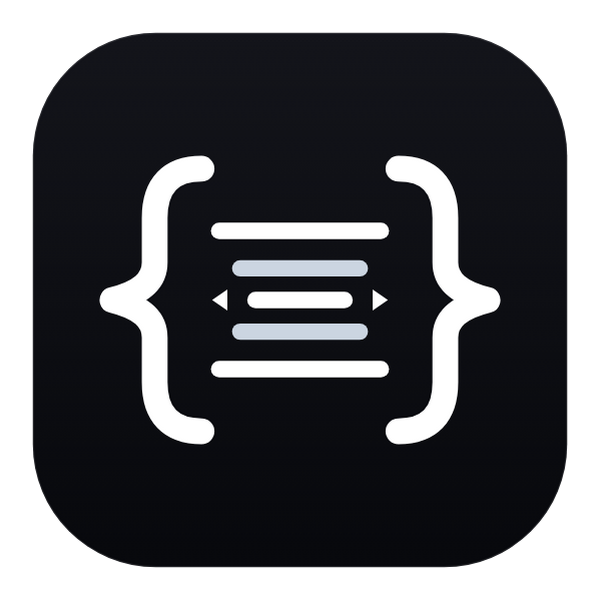
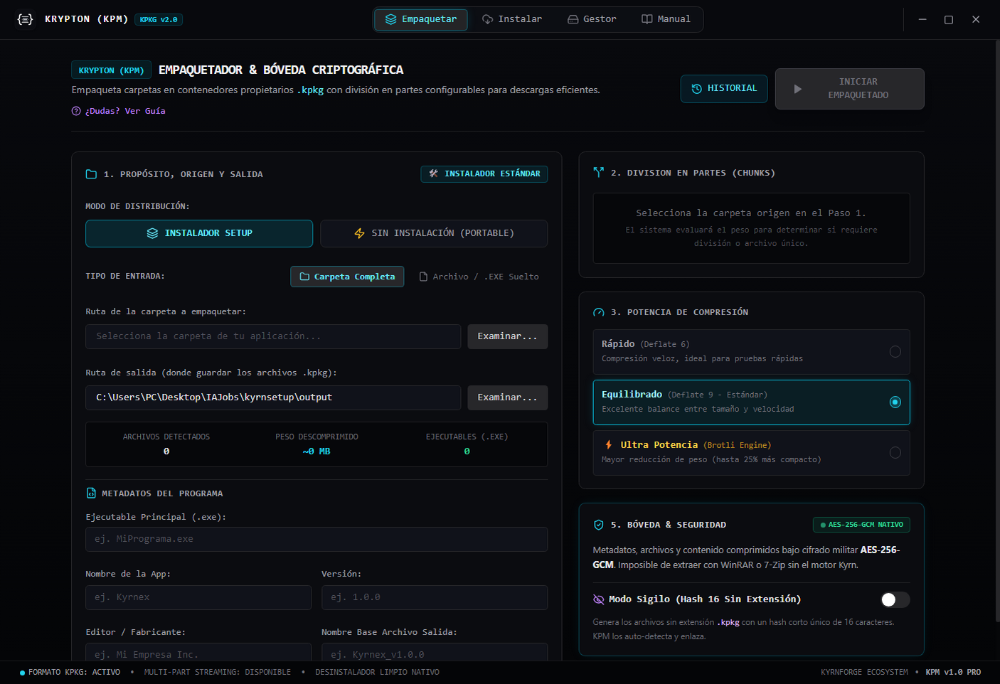
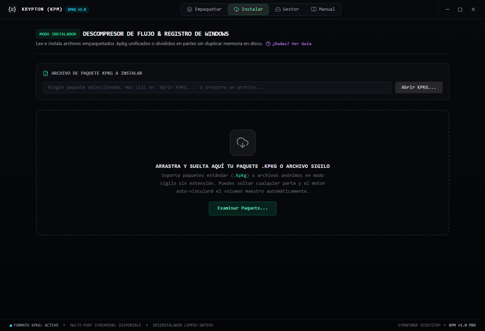
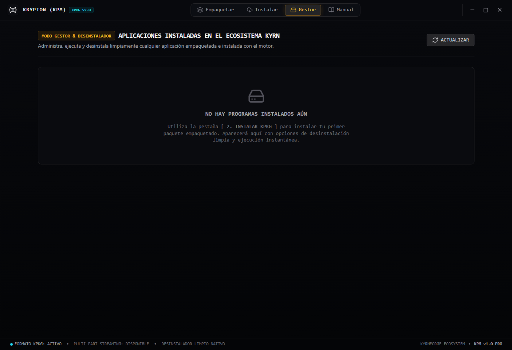
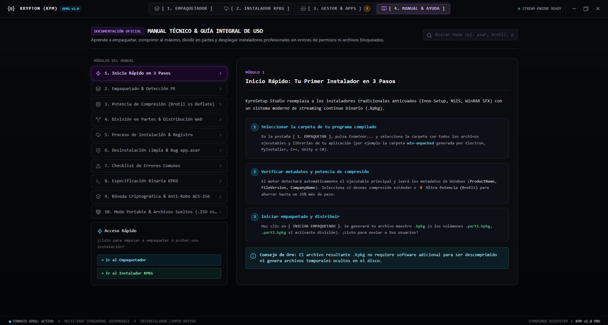

  

  # Krypton Package Manager (KPM) Studio
  ### Modern, High-Performance Packaging & Secure Distribution Suite for Windows

  
  [-0078D6.svg?style=for-the-badge&logo=windows)](https://github.com/devlwte/kpm-studio)
  
  
  

   

  

    🌐 <b>Language:</b> <b>English</b> | <a href="README.es.md">Español</a>
  

  

    <b>Krypton Package Manager (KPM)</b> is an all-in-one software packaging, compression, and distribution studio built from the ground up for modern Windows environments. It eliminates complex scripting and outdated tools by providing an intuitive visual interface, ultra-high ratio compression (Brotli Ultra + Deflate 9), an AES-256-GCM cryptographic vault, anonymous stealth mode, and on-the-fly streaming multi-part extraction.
  

  

    
  

---

## 🌟 Why KPM Studio?

Distributing software on Windows shouldn't require learning archaic scripting languages, wrestling with brittle configuration files, or worrying about whether someone can tamper with your binary files in transit.

**KPM Studio** was built to solve these issues:
- **Zero Scripting:** Build full-featured Windows setup installers or portable packages in seconds through an intuitive visual dashboard.
- **Extreme Compression:** Save gigabytes on game repacks, disc images, and software distributions using high-density Brotli Ultra compression.
- **Military-Grade Security:** Encrypt packages with AES-256-GCM and HKDF key derivation to prevent tampering and code injection.
- **Privacy & Stealth:** Package any file into an anonymous 16-hex hash with no file extension to avoid unwanted file scanning.

---

## 📸 Visual Showcase

### 1. Packer Studio
Full control over deployment types (Classic Setup Installer vs. Zero-Footprint Portable Mode), input source (full directory trees vs. standalone executables/files), compression profiles, and split volume thresholds:

### 2. Smart Extractor & Stream Decompressor
Drag and drop `.kpkg` packages or anonymous stealth files. Enjoy real-time streaming decompression telemetry, automatic volume re-linking, and password-protected vault unlocking:

### 3. Ecosystem Manager
Inspect installed applications, view native Windows PE metadata, launch programs in one click, and cleanly uninstall software through the native Windows registry:

### 4. Integrated Technical Guide
Includes 10 interactive chapters covering container specifications, cryptographic architecture, multi-volume streaming mechanics, and compression recommendations:

---

## ⚡ Core Features

### 🛠️ 1. Dual Deployment Modes
- **Classic Setup Installer:**
  - Standard Windows installation path (`AppData\Local\Programs\<AppName>`).
  - Automatically creates Desktop and Start Menu shortcuts.
  - Registers clean uninstall entries in Windows Settings and Control Panel (*Add/Remove Programs*).
  - Validation safeguard: requires a valid `.exe` binary to prevent broken shortcuts.
- **🚀 Zero-Footprint Portable Mode:**
  - Extracts directly into the folder of your choice without administrative friction.
  - **No registry pollution:** Leaves zero registry traces, creates no shortcuts, keeping the host system 100% pristine.
  - Supports packaging folders, raw disk images (`.iso`, `.img`), standalone executables, and general files.

### 🔒 2. AES-256-GCM Vault & Anonymous Stealth Mode
- **End-to-End Cryptographic Vault:** Manifest headers and compressed payloads are authenticated and encrypted using AES-256-GCM, backed by HKDF-SHA256 key derivation and 32-byte cryptographic salts.
- **Optional Vault Password:** Protect your proprietary packages with custom passwords. The decompressor provides an interactive lock interface with wrong-password detection.
- **Anonymous Stealth Mode:** Generate extensionless packages named with a 16-character hexadecimal hash (e.g., `1cc8493daf2ddebd`), making packages indistinguishable from generic data.
- **Anti-Tamper Verification:** If a single bit is modified or corrupted, the 16-byte GCM authentication tag immediately rejects the payload, preventing malware injection.

### 🗜️ 3. Dual-Engine Compression: Brotli Ultra vs. Deflate 9
- **Brotli Ultra (Level 11):** Achieves extreme compression ratios for uncompressed software assets and raw disk images (**`.iso` and `.img`**), achieving over **99% reduction** on repetitive sectors.
- **Deflate 9 (Fast):** Optimized for high-speed throughput. Perfect for already compressed archives (`.zip`, `.rar`, `.7z`) without wasting CPU cycles.

### 📦 4. Multi-Volume Streaming with Auto-Redirection
- Split massive applications into customizable parts (e.g., 25 MB, 100 MB, 500 MB, 2 GB, 4 GB) with `.partX.kpkg` or stealth filenames.
- **Zero-Temp Streaming:** Pipes concatenated data directly through memory, avoiding gigantic temporary cache files on the user's hard drive.
- **Smart Auto-Redirection:** Drop *Part 2* or *Part 3* onto the extractor window, and KPM will automatically locate and bind *Part 1* in the same directory to start decompression seamlessly.

### 🛡️ 5. Hardened V8 Bytecode Runtime
- The entire KPKG engine and Electron backend are compiled directly into **V8 Bytecode machine code (.jsc)** via Bytenode.
- **Zero plain-text source code:** No exposed JavaScript files are distributed with the application, safeguarding proprietary algorithms.

---

## 📥 Getting Started

### Official Windows Setup (Recommended)
1. Download [**Krypton-Package-Manager-Setup-v1.0.0.zip**](https://github.com/devlwte/kpm-studio/releases/download/v1.0.0/Krypton-Package-Manager-Setup-v1.0.0.zip) from the official [Releases](https://github.com/devlwte/kpm-studio/releases/tag/v1.0.0) page.
2. Extract the `.zip` archive.
3. Run `Krypton Package Manager Setup 1.0.0.exe` and follow the guided setup wizard.

---

## 📐 Binary Format Specification (KPKG v2)

| Offset / Size | Field | Description |
|---|---|---|
| `0x00 - 0x04` (5 bytes) | **Magic Header** | `"KPKG\x02"` (KPKG Vault Identifier v2) |
| `0x05` (1 byte) | **Vault Flags** | `0x01` Encrypted, `0x02` MultiPart, `0x04` Password |
| `0x06` (1 byte) | **Compression ID** | `0x01` Deflate 9, `0x02` Brotli Ultra |
| `0x07 - 0x26` (32 bytes)| **Cryptographic Salt** | Cryptographically secure random salt for HKDF |
| `0x27 - 0x2E` (8 bytes) | **Part & Chunk Info** | Volume index (uint16) and chunk size in MB |
| `0x2F - 0x3A` (12 bytes)| **Metadata IV** | AES-GCM Initialization Vector for header |
| `0x3B - 0x4A` (16 bytes)| **Metadata Tag** | GCM Authentication Tag for manifest envelope |
| `0x4B - 0x4E` (4 bytes) | **Metadata Length** | uint32LE length of encrypted JSON manifest |
| `0x4F - N` | **Ciphertext Envelope**| Authenticated AES-256-GCM encrypted metadata |
| `N+1 - N+12` (12 bytes) | **Payload IV** | Data stream Initialization Vector |
| `N+13 - EOF-24` | **Compressed Payload** | Encrypted and compressed binary payload |
| `EOF-24 - EOF-8` (16 B) | **Payload Tag** | Global GCM authentication tag for data payload |
| `EOF-8 - EOF` (8 bytes) | **Trailer Magic** | `"KPKGTRL2"` (Container integrity closing guard) |

---

## 📄 License & Distribution Terms

Krypton Package Manager Studio is released under the **Krypton Freeware and Distribution License**.

- **Free Distribution:** You are free to download, use, mirror, and share unmodified copies of the official software binaries and installers for personal, educational, or commercial purposes.
- **Code Integrity:** Reverse engineering, decompilation, disassembly, unauthorized modification, or selling the binaries is strictly prohibited.

For complete legal terms, please read the [LICENSE](LICENSE) file (available in English and Spanish).

---

  Crafted with passion for the Windows developer community by <b>KyrnForge / devlwte</b> (2026).

